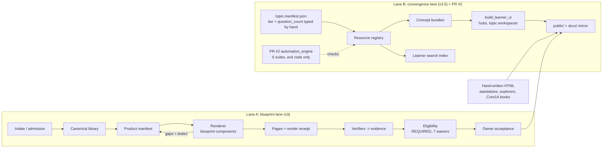
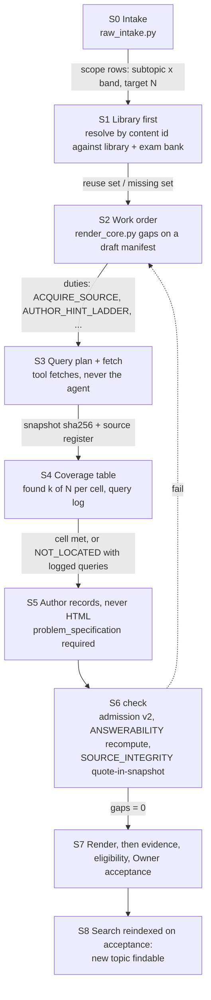

# Grade9 v4.0: architecture and upgrade specification

| | |
|---|---|
| Basis | `Grade9v3.5@9059848` (main), PR #2 `@266749f` (draft in v3.5; included in the v4.0 seed), blueprint registry 1.9.0 / shell 1.3.0 |
| Target | `reallaksh19/Grade9v4.0`, seeded at `b94b6fb3` from `Grade9v3.5@266749f` (main `9059848` + PR #2), full history |
| Status | Proposal. Every "today" cell was measured on that content (v3.5 `9059848`, PR #2 `266749f`). |

Two questions are answered:

1. Blueprint 1.9.0 against v3.5 + PR #2: what the gaps are, what to implement, and what has to be true to call the result v4.0.
2. How an agent researches a new topic effectively, using the blueprint as its work order.

---

# Part 1: Blueprint 1.9.0 vs v3.5 + PR #2

## 1.1 The system today: two lanes



Lane B publishes to the same `public/` without passing through the renderer, the verifiers or acceptance. PR #2 (now part of the v4.0 seed, by Owner decision) adds a checker over Lane B only. It writes no evidence, reads no blueprint, and touches neither `Shared/assurance` nor `Shared/web`.

## 1.2 Gap matrix: every element of blueprint 1.9.0

Gap classes:
- **G1 Declared only:** no tool executes it.
- **G2 Executed, red on main.**
- **G3 Blind to v3.5 surfaces:** it executes, but not where v3.5 added pages.
- **G4 Escapable:** it executes, and a thin or false input passes.
- **OK.**

| Blueprint 1.9.0 element | What it requires | Executor in v3.5 | Today on `main` | PR #2 | Gap |
|---|---|---|---|---|---|
| `typography_policy` | learner text ≥ 14 px | `standalone_conformance` (FONT_FLOOR), only under repo-root `standalone/` | 1,703 FONT_FLOOR findings on governed pages; topic, hub and QB pages not governed | — | G2, G3 |
| `math_policy` | local KaTeX, typed TeX, no runtime inference | **no tool reads it**; tests only assert the constant strings | 149 MATH_UNRENDERED + 17 control chars on governed pages, through standalone rules | — | G1 |
| `representation_accessibility_policy` | accessible name and description, no colour-only meaning | **none** (constants asserted in a test) | `ACCESSIBILITY` waived | — | G1 |
| `data_representation_policy` | comparative relations as data | **none** | — | — | G1 |
| `vendor_policy` | no external runtime | none reads it; REMOTE_RUNTIME rule for `standalone/` only | 7 remote runtimes on governed pages | — | G1, G3 |
| `print_policy` | PDF icon and link per Core page | `render_core` | only for rendered products | — | G3 |
| `standalone_policy` | 10 rules, fail-closed, ledger ratchet | `standalone_conformance`, assurance projection | **red**: all 34 ledger keys use `\`, so on Linux "62 pages worse than the ledger" (0 once keys are normalised); `public/` is not a governed root | — | G2, G3 |
| `search_policy` | every page found; results open | **absent from v3.5** (exists only in unmerged Grade9V3 commit `7ccaa2d4`) | two indexes (288 and 417 docs); header reads the 417 one | "Zero missing index": pages only, registry→index, circular | G1 |
| components: levels, column, depth, held_to, waivers | component contract per page | `web_blueprint_contract`, `render_core` | works for the 3 blueprints that have components | — | OK (3 of 7) |
| `BP-CORE1`, `BP-CORE1B`, `BP-CORE2A`, `BP-CORE2B` | page contract | **0 components each** (slots only) | page content not contract-checked | — | G1 |
| `coverage` (denominator) | completeness against a fixed denominator | `render_core gaps`, `product_coverage` | works: STATUS "0 of 21 products live"; gaps named | `question_count` typed in `topic.manifest.json`, never checked | OK in Lane A, G4 in Lane B |
| `admission` (8 points) | stem, options, givens, answer anchored, worked, verified | `question_admission` in intake | floors pass padding; `linear-equations`: 32/32 declare no specification, 32/32 keys author-only | — | G4 |
| question `status` and answer `verification_status` | closed enums; promotion only with a review receipt | schema, at CI only | **commit `1448267` edited 18 questions: `status` CANDIDATE → `PUBLISHED` (not in the schema enum; the only 18 "PUBLISHED" in all libraries), `verification_status` → `VERIFIED_CANONICAL` (not in the enum), and an unresolvable `topic_ref`; CI flagged S1; it landed on main** | — | G2, G4 |
| `evidence` (LF-normalised digests) | platform-independent evidence | `contract` | digests fine; **path keys** not normalised (the ledger bug is the same class) | — | G2 |
| Registry versioning | content change ⇒ version change | convention only | `BP-CORE1A` (+2 components, `default_theme` changed) and `BP-EXPLORER-GCDR` changed, versions unchanged; generated spec stale | — | G2 |
| Assurance `learner-release` | acceptance REQUIRED | `assurance_run`, `release_eligibility`, `accept_product` | REQUIRED, but 7 types waived: ANSWERABILITY, SOURCE_INTEGRITY, PROJECTION_COMPLETENESS, SELF_CONTAINMENT, REASONING_VALIDITY, RESPONSIVE_LAYOUT, ACCESSIBILITY; CI assurance job red and not blocking | — | G1 (×7), G2 |
| Page provenance | (no rule in 1.9.0) | — | 134 learner pages in `public/`; **1 render receipt** (friction); 31 carry renderer-style attributes without a receipt; 103 carry nothing that names their producer | Suite 2 blocks *undeclared* pages; a declared placeholder ("TBD", `question_count: 10`) entered registry and search, suites 1–5 green | G1, G4 |
| v3.5 page kinds | (no blueprint) | `build_learner_ui`, hand-written | Topic Workspace (14), Subject Hubs (3), Question Bank, Atlas, Practice hubs, 25 explorer pages: no blueprint governs them | Suite 3 checks tier names and link targets only | G1 |
| Generated outputs | rebuilt = committed | `blueprint_spec`, `build_manifest`, `build_pages_site` `--check` | **all three red** on a clean checkout | `--rebuild` rewrites ≥ 8 committed files (not a fixed point); docs sync points at a missing `scratch/` script; parity check covers 11 of 260 files | G2 |

Measured totals on `main`:
- **5 repo-owned gates red** on a clean checkout.
- **4 of 7 shell policies have no executor.**
- **4 of 7 page blueprints have no component contract.**
- **7 assurance types waived.**
- **1 of 134 published pages has a render receipt.**

## 1.3 What to implement

Each work package (WP) closes a gap class. "Done when" is a predicate a tool evaluates, never a statement.

| WP | Closes | Implement | Done when |
|---|---|---|---|
| **A Restore** | G2 | ledger path keys POSIX on read and write; repair `linear-equations` (true status only, resolvable `topic_ref`); registry version bumps plus a lock file (content digest per version); regenerate spec, manifest and Pages with their generators | all repo gates exit 0 on a clean checkout; a backslash-key test and a "content changed, version unchanged" test both fail on the mutant |
| **B Execute every policy** | G1 shell | rewrite `math`, `accessibility`, `data_representation`, `vendor`, `typography` as `rules[]` with `finding_codes` and severity, each read by a verifier (the pattern `standalone_policy` and `search_policy` already use); add a **meta-rule**: no policy key without an executor | a test walks the registry and fails on any policy key no verifier reads |
| **C One lane** | G3, Lane B | (1) site blueprints with components for Topic Workspace, Subject Hub, Question Bank, Atlas, Practice hub; (2) component contracts for CORE1, 1B, 2A, 2B; (3) registry, bundles, `topic.manifest.json` and indexes become **generated projections** of library and products: inputs declared, rebuilt and compared; tier and `question_count` derived, never typed | the placeholder experiment fails with a named finding; every projection rebuilds byte-identical |
| **D Provenance** | G1, G4 pages | `shell.provenance_policy`: a page in a published root carries a receipt (render or generator, digest-bound) or is listed in the legacy ledger, which only goes down | a new hand-written page fails CI; the ledger count never rises |
| **E Search** | G1 search | `shell.search_policy` (7 rules: PAGE_INDEXED, PAGE_TITLED, QUESTION_ANCHORED, RESULT_OPENS, INDEX_LOADABLE, UNROUTED_REPORTED, PUBLICATION_REINDEXES), rebuilt and compared, one index | verifier fails on a missing page, an edited document, a broken route; acceptance rebuilds the index |
| **F Content checkers** | G1 assurance | build the verifiers behind the 7 waivers: **ANSWERABILITY** (independent recompute), **SOURCE_INTEGRITY** (snapshot + quoted span), PROJECTION_COMPLETENESS (denominator), SELF_CONTAINMENT and REASONING_VALIDITY (via required `problem_specification`), RESPONSIVE_LAYOUT and ACCESSIBILITY (browser audit) | each waiver removed only when its verifier is certified; ANSWERABILITY and SOURCE_INTEGRITY can never be waived again |
| **G Orchestration** | PR #2's intent | one `check` entry point running every verifier through the assurance chain (evidence → eligibility); CLI, committed hook (`.githooks/` + `core.hooksPath`), CI and watcher as thin triggers; generators in fixed order, idempotent | run twice: no diff; a clean checkout: no diff; each PR #2 suite maps to a verifier |
| **H Governance** | G4 | CODEOWNERS on `Shared/assurance`, `Shared/web`, `Shared/policy`, waivers, baseline, ledger, workflows; CI fails a PR that changes content and gates together; required checks on `main`; work state computed (handoff tool), not typed | a mixed PR fails; a claimed commit not on `main` is reported as such |

PR #2 is in the v4.0 seed. WP-G absorbs its engine into the one `check` entry point (its six suites become verifiers that write evidence), and WP-C replaces its topic-manifest model (tier and counts typed by hand) with derived projections.

## 1.4 What has to be true to call it v4.0

v4.0 = **blueprint registry 2.0.0**, plus eight invariants that `check` computes on a clean checkout of `Grade9v4.0`:

| # | Invariant |
|---|---|
| I1 | No declarative-only policy: every registry policy key has an executor (meta-rule). |
| I2 | Every page kind in a published root has a blueprint with components; every published page has a receipt or a legacy-ledger entry. |
| I3 | One data spine: every derived artifact (registry, bundles, manifests, indexes, mirror, spec) rebuilds byte-identical. |
| I4 | Every repo gate exits 0; CI makes them required. |
| I5 | Acceptance REQUIRED; ANSWERABILITY and SOURCE_INTEGRITY have certified verifiers and no waiver; any remaining waiver is Owner-recorded with future scope. |
| I6 | Search: every page, topic, routed question and hint is indexed, and every result opens something. |
| I7 | Cheat test: an agent briefed to omit, pad, invent sources or edit a gate gets **nothing** through (measured red-team run). |
| I8 | Work state is computed from git and gates, never typed (no "18/18 complete" files). |

**Why a major version (2.0.0):** it breaks things.
- Tier, role and counts stop being typed by hand.
- `problem_specification` becomes required.
- The status vocabulary is closed.
- New page kinds need blueprints.
- Unreceipted pages stop being publishable.

**Repository:**
1. `Grade9v4.0` is seeded (`b94b6fb3`): `Grade9v3.5@266749f` (main `9059848` + PR #2) with full history and a `PROVENANCE.md`.
2. Land WP-A first.
3. Then B, C, D and E in parallel.
4. Then F, then G and H.
5. v3.5 stays frozen as the reference.


---

# Part 2: Agent research for a new topic

## 2.1 Principle

The agent never decides how much research is enough. **The blueprint does.** Every REQUIRED or EXPECTED component names its `source` fields. The renderer's `gaps` command turns a draft product into a list of named duties. That list is the agent's job, and its denominator.

## 2.2 Pipeline



| Stage | Artifact the agent produces | Gate that judges it | Exists in v3.5? |
|---|---|---|---|
| S0 Intake | intake record, content-derived ids, **scope rows with target N** (subtopic × difficulty band) | N fixed before research starts; Owner can set it | `raw_intake.py` exists; N not emitted |
| S1 Library first | reuse set / missing set | dedup by content id; a new record that duplicates a canonical one is refused | resolver exists |
| S2 Work order | duty list from `render_core.py gaps` (26 duty kinds today) | the duty list *is* the job; done = 0 duties | exists |
| S3 Fetch | `Sources/snapshots/<sha256>` + register entry {url, retrieved_at, sha256, authority_class} | fetch done by a tool; the agent cannot write a snapshot | **missing**: `Sources/` holds 2 receipts; `exam-source-verification` has `acquisition_refs` as free strings and self-declared `verification`; 0 records use it |
| S4 Coverage | per cell: found k of N, the queries run and their result counts | a cell closes when k ≥ N, or as NOT_LOCATED with the logged queries attached | **missing** |
| S5 Records | library records with `problem_specification`, cited snapshot digest + quoted span | admission v2 | admission exists (floors); specification not required |
| S6 Check | evidence records | ANSWERABILITY recomputes every answer; SOURCE_INTEGRITY finds every quoted span in its snapshot | **both waived today** |
| S7 Render | pages + render receipt | gaps = 0; eligibility | exists |
| S8 Findable | index entries | `search_policy` (PUBLICATION_REINDEXES) | **missing in v3.5** |

## 2.3 What makes the search effective, not just long

1. **Query plan from scope, not from the agent's guess.** Each (subtopic × band) cell expands into queries: syllabus row terms, NCERT chapter and exercise ids, exam and paper ids, and the misconception vocabulary the topic's diagnostics name.
2. **Authority order is data.** Official exam archive and NCERT come first; secondary discovery is used only to locate an official copy (`authority_class` already has OFFICIAL_EXAM_ORGANIZER_ARCHIVE / SECONDARY_DISCOVERY_ONLY / NOT_LOCATED).
3. **Every query is logged with its result count.** "Not found" is a claim with evidence, so it can be re-run and checked.
4. **Library first, web second.** S1 avoids re-researching what the library already holds.
5. **Stop rule = coverage, not effort.** The job ends when every cell is met or NOT_LOCATED with its log, and the duty list is empty.

## 2.4 How an agent uses the blueprint

The agent's instructions are commands, not prose:

```
raw_intake.py   --input request.json            # scope rows and target N
resolve_request.py ...                          # library-first reuse set
render_core.py  gaps --manifest draft.json      # the work order
source fetch    <url>                           # snapshot + register (tool to build, WP-F)
check                                           # every verifier; evidence (WP-G)
render_core.py  build --manifest draft.json     # only when gaps = 0
```

The agent's report is the output of `check`, which the gate recomputes. A claim the agent types (complete, verified, not found) counts only when a tool produced it.

## 2.5 Which escapes this closes

| Escape | Closed by |
|---|---|
| Omit | N fixed at S0; `gaps` duty list; "k of N" shown; acceptance blocks below target |
| Pad | ANSWERABILITY recompute; required `problem_specification`; length floors kept only as a backstop |
| Fake research | tool-made snapshots; quoted span must occur in the snapshot; NOT_LOCATED needs a query log |
| Excuse / invent status | closed vocabularies checked at commit and in CI; agents cannot edit gates (WP-H); state computed (I8) |
| Hand-written page | provenance policy (WP-D) |

**Limit:** explanation quality is not fully measurable. A rubric pass by a second agent plus an Owner sample covers it. The sample matters because a second agent shares the first one's blind spots.

---

## Decisions

| # | Decision | Outcome |
|---|---|---|
| 1 | Seed `Grade9v4.0` | Done: `Grade9v3.5@266749f` (main `9059848` + PR #2), full history, `b94b6fb3` |
| 2 | Push access to `Grade9v4.0` | Granted |
| 3 | Core 1A default theme | Not a decision: the site has two global themes. The registry change still needs its version bump (WP-A). |
| 4 | Mathematics `topic_ref` | Proposal in [GOVERNANCE.md](GOVERNANCE.md#5-the-mathematics-linear-equations-records) |
| 5 | Required checks and CODEOWNERS | Plan in [GOVERNANCE.md](GOVERNANCE.md); the Owner applies the ruleset |
